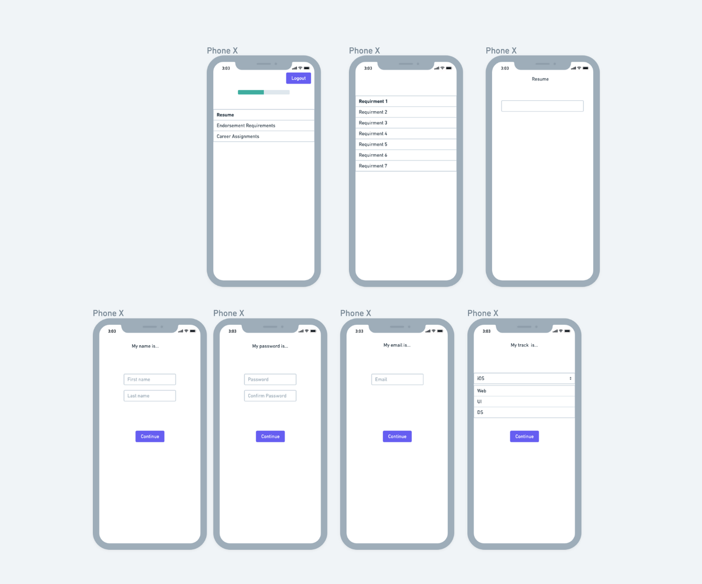

# The 'ENDRSD' iOS App

[![Swift Version][swift-image]][swift-url]
[![Build Status][travis-image]][travis-url]
[![License][license-image]][license-url]

  

    

    

## Project Overview

"ENDRSD" is a capstone project that was built as a centralized location for Lambda School students to access track-specific career endorsement requirements, as well as provide students with a fun and engaging way to track their career endorsement progress.

Demo the project by clicking the ENDRSD logo (above the "Contributors" section) or find the deployed project at <a href="https://app.netlify.com/sites/labs15/deploys" style="padding-left: 20px"><a/>

 

## Contributors

|                                                                                         [Alex Mata](https://github.com/alexander-frost)                                                                                         |                                                                                      [Sameera Roussi](https://github.com/sameeraleola)                                                                                       |                                                                                        [Victor Ruiz](https://github.com/vicxruiz)                                                                                        |
| :-----------------------------------------------------------------------------------------------------------------------------------------------------------------------------------------------------------------------------: | :--------------------------------------------------------------------------------------------------------------------------------------------------------------------------------------------------------------------------: | :----------------------------------------------------------------------------------------------------------------------------------------------------------------------------------------------------------------------: |
|  |  |  |
|                                                                                                                                     |                                                                                                                                     |                                                                                                                                     |
|                                                                                                  |                                                                                                |                                                                                                 |

## Project Overview

1️⃣ You can find the deployed project at [🚫URL NAME GOES HERE](🚫copy and paste URL here).

[Trello Board](https://trello.com/b/hKTAKrBD/endrsd)

[Product Canvas](https://www.notion.so/Career-Endorsement-Tracker-38de5156701f4cebb29de81a4b6db1ad)

[UX Design files](https://www.notion.so/Mockups-4c32cd42f99447a998f6a6c619457f13)

ENDRSD is a dual-platform (WEB & iOS) application that provides easily accessible insight to one’s own learning progress (as a student) and any given students’ progress (as a coach/manager).

### Features

- Users can sign-up and login via both platforms (WEB & iOS)
- Logged-in users to see a list of their track-specific 'requirements'
- A logged-in user will be able to view a list of 'steps' that are to be completed for each associated 'requirement'
- A logged-in user will be able to manually toggle the 'completed' or 'incompleted' status of a 'step'
- Logged-in users will be able to view their overall endorsement progress, which is always up-to-date with the latest changes

### Authentication API here

🚫Replace text below with a description of the API

Water's like me. It's laaazy ... Boy, it always looks for the easiest way to do things A little happy sunlight shining through there. Let all these little things happen. Don't fight them. Learn to use them. Even the worst thing we can do here is good.

### Payment API here

🚫Replace text below with a description of the API

This is the way you take out your frustrations. Get away from those little Christmas tree things we used to make in school. Isn't it fantastic that you can change your mind and create all these happy things? Everything's not great in life, but we can still find beauty in it.

### Misc API here

🚫Replace text below with a description of the API

You can do anything your heart can imagine. In life you need colors. This is where you take out all your hostilities and frustrations. It's better than kicking the puppy dog around and all that so. I'm sort of a softy, I couldn't shoot Bambi except with a camera. Trees get lonely too, so we'll give him a little friend. We'll lay all these little funky little things in there.

### Misc API here

🚫Replace text below with a description of the API

When you do it your way you can go anywhere you choose. Let your heart take you to wherever you want to be. If I paint something, I don't want to have to explain what it is. A tree needs to be your friend if you're going to paint him. That's a son of a gun of a cloud. Even the worst thing we can do here is good.

### Misc API here

🚫Replace text below with a description of the API

Volunteering your time; it pays you and your whole community fantastic dividends. Maybe there's a happy little waterfall happening over here. You can spend all day playing with mountains. We don't have to be committed. We are just playing here. You have freedom here. The only guide is your heart. It's cold, but it's beautiful.

## Requirements

🚫 These are examples, make sure this matches your project's requirements

- iOS 8.0+
- Xcode 7.3
- Cocoa Pods

## Contributing

When contributing to this repository, please first discuss the change you wish to make via issue, email, or any other method with the owners of this repository before making a change.

Please note we have a [code of conduct](./CODE_OF_CONDUCT.md). Please follow it in all your interactions with the project.

### Issue/Bug Request

    ## Contributing

When contributing to this repository, please first discuss the change you wish to make via issue, email, or any other method with the owners of this repository before making a change.

Please note we have a [code of conduct](./code_of_conduct.md). Please follow it in all your interactions with the project.

### Issue/Bug Request

**If you are having an issue with the existing project code, please submit a bug report under the following guidelines:**

- Check first to see if your issue has already been reported.
- Check to see if the issue has recently been fixed by attempting to reproduce the issue using the latest master branch in the repository.
- Create a live example of the problem.
- Submit a detailed bug report including your environment & browser, steps to reproduce the issue, actual and expected outcomes, where you believe the issue is originating from, and any potential solutions you have considered.

### Feature Requests

We would love to hear from you about new features which would improve this app and further the aims of our project. Please provide as much detail and information as possible to show us why you think your new feature should be implemented.

### Pull Requests

If you have developed a patch, bug fix, or new feature that would improve this app, please submit a pull request. It is best to communicate your ideas with the developers first before investing a great deal of time into a pull request to ensure that it will mesh smoothly with the project.

Remember that this project is licensed under the MIT license, and by submitting a pull request, you agree that your work will be, too.

#### Pull Request Guidelines

- Ensure any install or build dependencies are removed before the end of the layer when doing a build.
- Update the README.md with details of changes to the interface, including new plist variables, exposed ports, useful file locations and container parameters.
- Ensure that your code conforms to our existing code conventions and test coverage.
- Include the relevant issue number, if applicable.
- You may merge the Pull Request in once you have the sign-off of two other developers, or if you do not have permission to do that, you may request the second reviewer to merge it for you.

### Attribution

These contribution guidelines have been adapted from [this good-Contributing.md-template](https://gist.github.com/PurpleBooth/b24679402957c63ec426).

## Documentation

See [Backend Documentation](_link to your backend readme here_) for details on the backend of our project.

[swift-image]: https://img.shields.io/badge/swift-3.0-orange.svg
[swift-url]: https://swift.org/
[license-image]: https://img.shields.io/badge/License-MIT-blue.svg
[license-url]: LICENSE
[travis-image]: https://img.shields.io/travis/dbader/node-datadog-metrics/master.svg?style=flat-square
[travis-url]: https://travis-ci.org/dbader/node-datadog-metrics
[codebeat-image]: https://codebeat.co/badges/c19b47ea-2f9d-45df-8458-b2d952fe9dad
[codebeat-url]: https://codebeat.co/projects/github-com-vsouza-awesomeios-com
